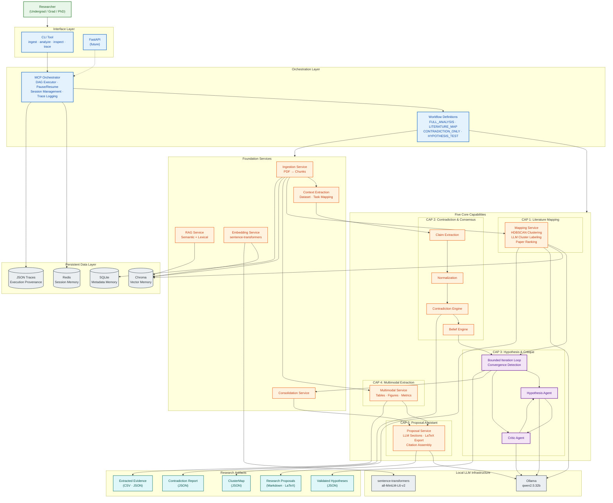

# ScholarOS — High-Level Architecture Diagram

## Legend

| Color | Layer |
|-------|-------|
| Green | User / Researcher |
| Blue | Orchestration & Interface |
| Orange | Deterministic MCP Services |
| Purple | Agentic Reasoning (LLM-backed) |
| Grey | Data Stores & Infrastructure |
| Teal | Output Artifacts |
