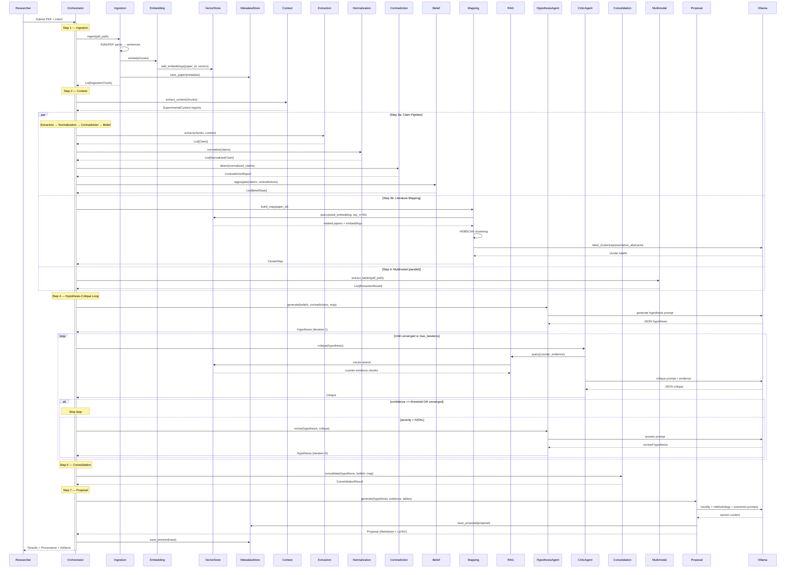
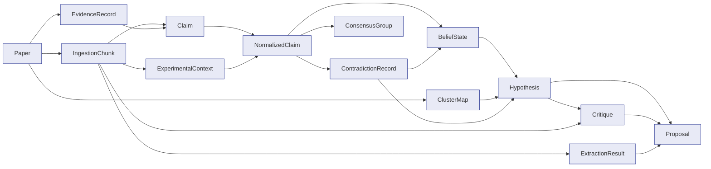

# ScholarOS — Low-Level Design Diagram

```mermaid
graph TB
    %% ============================================================
    %% STYLING
    %% ============================================================
    classDef user fill:#E8F5E9,stroke:#2E7D32,stroke-width:2px,color:#1B5E20
    classDef orch fill:#E3F2FD,stroke:#1565C0,stroke-width:2px,color:#0D47A1
    classDef svc fill:#FFF3E0,stroke:#E65100,stroke-width:1.5px,color:#BF360C
    classDef agent fill:#F3E5F5,stroke:#6A1B9A,stroke-width:2px,color:#4A148C
    classDef schema fill:#E8EAF6,stroke:#283593,stroke-width:1px,color:#1A237E
    classDef store fill:#ECEFF1,stroke:#37474F,stroke-width:1.5px,color:#263238
    classDef mcp fill:#FFF9C4,stroke:#F57F17,stroke-width:1px,color:#E65100
    classDef llm fill:#FCE4EC,stroke:#AD1457,stroke-width:1.5px,color:#880E4F
    classDef trace fill:#E0F2F1,stroke:#00695C,stroke-width:1px,color:#004D40

    %% ============================================================
    %% USER INPUT
    %% ============================================================
    PDF["PDF / DOI / arXiv ID<br/>or Topic Query"]:::user

    %% ============================================================
    %% STEP 1: INGESTION PIPELINE
    %% ============================================================
    subgraph STEP1["Step 1: Ingestion"]
        direction TB
        PDF_LOADER["pdf_loader_pymupdf.py<br/>PyMuPDF Parser"]:::svc
        SENT_SEG["sentence_segmenter.py<br/>Sentence Splitter<br/>Abbreviation Handling"]:::svc
        TABLE_EXT["table_extractor.py<br/>Table Region Detection"]:::svc
        ING_SVC["ingestion/service.py<br/>IngestionService.ingest()<br/>→ List[IngestionChunk]"]:::svc
        ING_TOOL["ingestion/tool.py<br/>IngestionTool (MCP)<br/>manifest: ingestion"]:::mcp

        PDF_LOADER --> SENT_SEG
        PDF_LOADER --> TABLE_EXT
        SENT_SEG --> ING_SVC
        TABLE_EXT --> ING_SVC
        ING_SVC --> ING_TOOL
    end

    %% ============================================================
    %% STEP 1b: EMBEDDING + VECTOR STORAGE
    %% ============================================================
    subgraph STEP1B["Step 1b: Embedding & Storage"]
        direction TB
        EMB_SVC["embedding/service.py<br/>EmbeddingService.embed()<br/>all-MiniLM-L6-v2 (384-dim)"]:::svc
        EMB_TOOL["embedding/tool.py<br/>EmbeddingTool (MCP)"]:::mcp
        VS_SVC["vectorstore/service.py<br/>VectorStoreService<br/>.add_embeddings() .query()"]:::svc
        VS_TOOL["vectorstore/tool.py<br/>VectorStoreTool (MCP)"]:::mcp
        MS_SVC["metadatastore/service.py<br/>MetadataStoreService<br/>.save_paper() .save_claims()"]:::svc
        MS_TOOL["metadatastore/tool.py<br/>MetadataStoreTool (MCP)"]:::mcp

        EMB_SVC --> EMB_TOOL
        VS_SVC --> VS_TOOL
        MS_SVC --> MS_TOOL
    end

    %% ============================================================
    %% STEP 2: CONTEXT EXTRACTION
    %% ============================================================
    subgraph STEP2["Step 2: Context Extraction"]
        direction TB
        CTX_SVC["context/service.py<br/>ContextExtractionService<br/>Dataset→TaskType Mapping<br/>Metric Direction Inference"]:::svc
        CTX_TOOL["context/tool.py<br/>ContextExtractionTool (MCP)<br/>manifest: context_extraction"]:::mcp
        CTX_SVC --> CTX_TOOL
    end

    %% ============================================================
    %% STEP 3a: CLAIM PIPELINE (Linear)
    %% ============================================================
    subgraph STEP3A["Step 3a: Claim Analysis Pipeline"]
        direction TB

        subgraph EXTRACT["Claim Extraction"]
            EX_SVC["extraction/service.py<br/>ExtractionService.extract()<br/>3 Types: PERFORMANCE ·<br/>EFFICIENCY · STRUCTURAL<br/>90+ Verb Lexicon"]:::svc
            EX_STITCH["context_stitcher.py<br/>Context Joining"]:::svc
            EX_WEAK["weak_claim_validator.py<br/>Confidence Thresholding"]:::svc
            EX_TOOL["extraction/tool.py<br/>ExtractionTool (MCP)<br/>manifest: extraction"]:::mcp
            EX_SVC --> EX_STITCH --> EX_WEAK --> EX_TOOL
        end

        subgraph NORM["Normalization"]
            NM_ONT["metric_ontology.py<br/>100+ Metric Synonyms<br/>Unit Conversion Rules"]:::svc
            NM_DIAG["diagnostics.py<br/>Rejection Diagnostics"]:::svc
            NM_SVC["normalization/service.py<br/>NormalizationService<br/>.normalize()"]:::svc
            NM_TOOL["normalization/tool.py<br/>NormalizationTool (MCP)<br/>manifest: normalization"]:::mcp
            NM_ONT --> NM_SVC
            NM_DIAG --> NM_SVC
            NM_SVC --> NM_TOOL
        end

        subgraph CONTRA["Contradiction Detection"]
            CN_REL["relation_engine.py<br/>Polarity · Value Divergence<br/>Conditional Divergence"]:::svc
            CN_EPI["epistemic_relations.py<br/>Epistemic Relationship Model"]:::svc
            CN_SVC["contradiction/service.py<br/>ContradictionService<br/>→ ContradictionRecord[]<br/>→ ConsensusGroup[]"]:::svc
            CN_TOOL["contradiction/tool.py<br/>ContradictionTool (MCP)<br/>manifest: contradiction"]:::mcp
            CN_REL --> CN_SVC
            CN_EPI --> CN_SVC
            CN_SVC --> CN_TOOL
        end

        subgraph BLF["Belief Aggregation"]
            BL_SVC["belief/service.py<br/>BeliefService<br/>Confidence Calibration<br/>HIGH ≥3 claims 75%<br/>MEDIUM ≥2 claims 60%"]:::svc
            BL_TOOL["belief/tool.py<br/>BeliefTool (MCP)<br/>manifest: belief"]:::mcp
            BL_SVC --> BL_TOOL
        end

        EX_TOOL --> NM_TOOL
        NM_TOOL --> CN_TOOL
        CN_TOOL --> BL_TOOL
    end

    %% ============================================================
    %% STEP 3b: LITERATURE MAPPING (Parallel)
    %% ============================================================
    subgraph STEP3B["Step 3b: Literature Mapping (Parallel)"]
        direction TB
        MAP_CLUST["mapping/clusterer.py<br/>HDBSCAN (seeded)<br/>min_cluster_size=3"]:::svc
        MAP_LABEL["mapping/labeler.py<br/>LLM Cluster Labeling<br/>Versioned Prompt"]:::llm
        MAP_SVC["mapping/service.py<br/>LiteratureMappingService<br/>Aggregate Paper Embeddings<br/>→ ClusterMap"]:::svc
        MAP_TOOL["mapping/tool.py<br/>MappingTool (MCP)<br/>manifest: mapping"]:::mcp

        MAP_CLUST --> MAP_SVC
        MAP_LABEL --> MAP_SVC
        MAP_SVC --> MAP_TOOL
    end

    %% ============================================================
    %% STEP 4: HYPOTHESIS-CRITIQUE LOOP
    %% ============================================================
    subgraph STEP4["Step 4: Hypothesis-Critique Loop"]
        direction TB

        subgraph HYPO_AGENT["Hypothesis Agent"]
            HA_AGENT["hypothesis/agent.py<br/>HypothesisAgent<br/>.generate() .revise()<br/>JSON Extraction + Validation"]:::agent
            HA_PROMPT["Prompt v1.1.0<br/>HYPOTHESIS_GENERATE_PROMPT<br/>HYPOTHESIS_REVISE_PROMPT"]:::llm
            HA_AGENT --> HA_PROMPT
        end

        subgraph CRITIC_AGENT["Critic Agent"]
            CA_AGENT["critic/agent.py<br/>CriticAgent<br/>.critique()<br/>Severity: CRITICAL·HIGH·<br/>MEDIUM·LOW"]:::agent
            CA_PROMPT["Prompt v1.1.0<br/>CRITIC_EVALUATE_PROMPT"]:::llm
            CA_AGENT --> CA_PROMPT
        end

        LOOP_PY["agents/loop.py<br/>HypothesisCritiqueLoop<br/>max_iterations=5<br/>confidence_threshold=0.8<br/>Convergence Detection<br/>User Intervention Points"]:::agent

        LOOP_TOOL["agent_loop/tool.py<br/>AgentLoopTool (MCP)<br/>manifest: hypothesis_critique_loop"]:::mcp

        HA_AGENT <-->|"propose → critique → revise"| CA_AGENT
        LOOP_PY --> HA_AGENT
        LOOP_PY --> CA_AGENT
        LOOP_PY --> LOOP_TOOL
    end

    %% ============================================================
    %% STEP 5: CONSOLIDATION
    %% ============================================================
    subgraph STEP5["Step 5: Consolidation"]
        direction TB
        CON_SVC["consolidation/service.py<br/>ConsolidationService<br/>Validated Hypotheses +<br/>Key Findings + Open Questions"]:::svc
        CON_TOOL["consolidation/tool.py<br/>ConsolidationTool (MCP)"]:::mcp
        CON_SVC --> CON_TOOL
    end

    %% ============================================================
    %% STEP 6: MULTIMODAL (Parallel from Step 1)
    %% ============================================================
    subgraph STEP6["Step 6: Multimodal Extraction (Parallel)"]
        direction TB
        MM_SVC["multimodal/service.py<br/>MultimodalService<br/>Table Detection (regex + PyMuPDF)<br/>Metric Extraction (30+ patterns)<br/>Caption Association"]:::svc
        MM_TOOL["multimodal/tool.py<br/>MultimodalTool (MCP)<br/>manifest: multimodal_extraction"]:::mcp
        MM_SVC --> MM_TOOL
    end

    %% ============================================================
    %% STEP 7: PROPOSAL GENERATION
    %% ============================================================
    subgraph STEP7["Step 7: Proposal Generation"]
        direction TB
        PR_LLM["proposal/llm_sections.py<br/>LLM Section Generators<br/>Novelty · Methodology · Outcomes"]:::llm
        PR_LATEX["proposal/latex_renderer.py<br/>LaTeX Template Rendering"]:::svc
        PR_SVC["proposal/service.py<br/>ProposalService<br/>Citation Assembly<br/>Markdown Rendering"]:::svc
        PR_TOOL["proposal/tool.py<br/>ProposalTool (MCP)<br/>manifest: proposal"]:::mcp

        PR_LLM --> PR_SVC
        PR_LATEX --> PR_SVC
        PR_SVC --> PR_TOOL
    end

    %% ============================================================
    %% RAG SERVICE (Shared)
    %% ============================================================
    subgraph RAG_BOX["Semantic Retrieval (Shared)"]
        direction TB
        RAG_SVC["rag/service.py<br/>SemanticRAGService<br/>Chroma Vector Query<br/>Lexical Fallback<br/>0.7 semantic + 0.3 lexical"]:::svc
        RAG_TOOL["rag/tool.py<br/>RAGTool (MCP)<br/>manifest: rag"]:::mcp
        RAG_SVC --> RAG_TOOL
    end

    %% ============================================================
    %% ORCHESTRATOR
    %% ============================================================
    subgraph ORCH["Orchestrator"]
        direction TB
        DAG["orchestrator/dag.py<br/>DAGDefinition · DAGNode<br/>Topological Sort<br/>Conditional Branches"]:::orch
        MCP_ORCH["orchestrator/mcp_orchestrator.py<br/>MCPOrchestrator<br/>.execute_dag() .execute_pipeline()<br/>.pause_at() .resume_pipeline()<br/>Bounded Retry (max 3)<br/>Schema-Aware Payload Pruning"]:::orch
        WKFLOWS["orchestrator/workflows.py<br/>FULL_ANALYSIS<br/>LITERATURE_MAP<br/>CONTRADICTION_ONLY"]:::orch
        DAG --> MCP_ORCH
        WKFLOWS --> MCP_ORCH
    end

    %% ============================================================
    %% CORE LAYER
    %% ============================================================
    subgraph CORE["Core Layer"]
        direction LR

        subgraph SCHEMAS["core/schemas/ (14 modules)"]
            S_CHUNK["chunk.py<br/>IngestionChunk"]:::schema
            S_CLAIM["claim.py<br/>Claim · Polarity"]:::schema
            S_NCLAIM["normalized_claim.py<br/>NormalizedClaim"]:::schema
            S_CMAP["cluster_map.py<br/>ClusterMap"]:::schema
            S_CREPORT["contradiction_report.py<br/>ContradictionRecord"]:::schema
            S_HYPO["hypothesis.py<br/>Hypothesis"]:::schema
            S_CRIT["critique.py<br/>Critique"]:::schema
            S_PROP["proposal.py<br/>Proposal"]:::schema
            S_EVID["evidence.py<br/>EvidenceRecord"]:::schema
            S_ECTX["experimental_context.py<br/>ExperimentalContext"]:::schema
            S_SESS["session.py<br/>Session"]:::schema
        end

        subgraph VALIDATORS["core/validators/ (15 modules)"]
            V_ALL["*_validator.py<br/>Field presence · Type check<br/>Provenance enforcement<br/>Structured error reporting"]:::schema
        end

        subgraph MCP_CORE["core/mcp/"]
            MCP_BASE["mcp_tool.py<br/>Base MCPTool<br/>GET /manifest · POST /call"]:::mcp
            MCP_REG["registry.py<br/>MCPRegistry<br/>Tool Discovery"]:::mcp
            MCP_MAN["mcp_manifest.py<br/>MCPManifest Schema"]:::mcp
            MCP_TRACE["trace.py<br/>ExecutionTrace<br/>TraceEntry · JSONTraceStore"]:::trace
        end

        subgraph LLM_CORE["core/llm/"]
            LLM_CLIENT["client.py<br/>OllamaClient<br/>HTTP · Token Tracking<br/>Timeout · Prompt Versioning"]:::llm
            LLM_PROMPTS["prompts.py<br/>All Versioned Prompts<br/>CLUSTER_LABEL · HYPOTHESIS<br/>CRITIC · PROPOSAL"]:::llm
        end

        subgraph OBS["core/observability/"]
            OBS_P5["phase5.py<br/>Tracing · Audit"]:::trace
            OBS_MET["metrics_collector.py<br/>Latency · Tokens · Yield"]:::trace
            OBS_PROV["provenance_audit.py<br/>Chain Validator"]:::trace
        end
    end

    %% ============================================================
    %% DATA STORES
    %% ============================================================
    subgraph DATASTORES["Data Stores (Docker)"]
        direction LR
        CHROMA_DB[("Chroma 0.5.23<br/>:8001<br/>Vector Embeddings<br/>Cosine Similarity")]:::store
        SQLITE_DB[("SQLite<br/>.local/researcher_ai.db<br/>Papers · Claims<br/>Hypotheses · Proposals")]:::store
        REDIS_DB[("Redis 7<br/>:6379<br/>Session State<br/>RDB + AOF")]:::store
        OLLAMA_SVC["Ollama 0.6.0<br/>:11434<br/>qwen2.5:32b"]:::llm
        TRACE_FS[("JSON Files<br/>.local/traces/<br/>Execution Provenance")]:::store
    end

    %% ============================================================
    %% MAIN FLOW CONNECTIONS
    %% ============================================================
    PDF --> STEP1
    STEP1 --> STEP1B
    ING_TOOL --> EMB_SVC
    ING_TOOL --> MS_SVC
    EMB_TOOL --> VS_SVC

    STEP1 --> STEP2
    ING_TOOL --> CTX_TOOL

    %% Parallel paths after context
    STEP2 --> STEP3A
    CTX_TOOL --> EX_TOOL
    STEP1B --> STEP3B
    VS_TOOL --> MAP_SVC

    %% Both feed into agents
    BL_TOOL --> LOOP_PY
    MAP_TOOL --> LOOP_PY

    %% RAG feeds agents
    RAG_TOOL --> CA_AGENT

    %% Agent → Consolidation → Proposal
    LOOP_TOOL --> CON_TOOL
    CON_TOOL --> PR_TOOL

    %% Multimodal parallel path
    STEP1 --> STEP6
    ING_TOOL --> MM_SVC
    MM_TOOL --> PR_TOOL

    %% Orchestrator controls everything
    MCP_ORCH --> ING_TOOL
    MCP_ORCH --> CTX_TOOL
    MCP_ORCH --> EX_TOOL
    MCP_ORCH --> NM_TOOL
    MCP_ORCH --> CN_TOOL
    MCP_ORCH --> BL_TOOL
    MCP_ORCH --> MAP_TOOL
    MCP_ORCH --> LOOP_TOOL
    MCP_ORCH --> CON_TOOL
    MCP_ORCH --> MM_TOOL
    MCP_ORCH --> PR_TOOL
    MCP_ORCH --> RAG_TOOL

    %% Data store connections
    VS_SVC --> CHROMA_DB
    RAG_SVC --> CHROMA_DB
    MS_SVC --> SQLITE_DB
    MCP_ORCH --> REDIS_DB
    MCP_ORCH --> TRACE_FS
    LLM_CLIENT --> OLLAMA_SVC

    %% MCP Registry
    MCP_REG --> ING_TOOL
    MCP_REG --> EX_TOOL
    MCP_REG --> NM_TOOL
    MCP_REG --> CN_TOOL
    MCP_REG --> BL_TOOL
    MCP_REG --> MAP_TOOL
    MCP_REG --> LOOP_TOOL
    MCP_REG --> PR_TOOL
    MCP_REG --> RAG_TOOL
    MCP_REG --> MM_TOOL
    MCP_REG --> VS_TOOL
    MCP_REG --> MS_TOOL
    MCP_REG --> EMB_TOOL
    MCP_REG --> CON_TOOL
```

## Data Flow Summary

## Schema Dependency Graph

## Component Counts

| Layer | Count | Pattern |
|-------|-------|---------|
| Schemas | 14 | `core/schemas/*.py` (Pydantic v2) |
| Validators | 15 | `core/validators/*_validator.py` |
| MCP Tools | 14 | `services/*/tool.py` (GET /manifest + POST /call) |
| Services | 13 | `services/*/service.py` (stateless, deterministic) |
| Agents | 2 | `agents/hypothesis/`, `agents/critic/` (LLM-backed) |
| Data Stores | 4 | Chroma, SQLite, Redis, JSON traces |
| Docker Services | 3 | Chroma 0.5.23, Redis 7, Ollama 0.6.0 |
